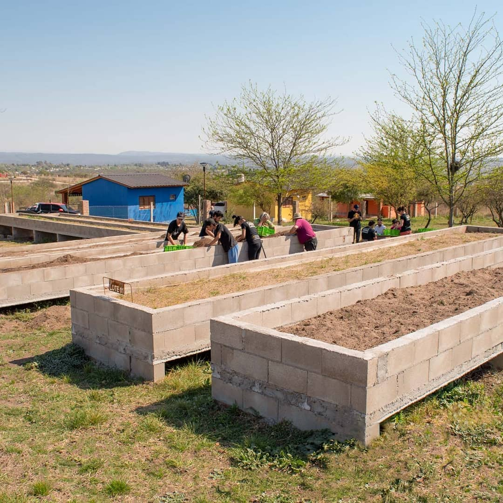

# Tesis de grado. Grupo 6/2021
Este repositorio esta destinado al desarrollo de la tesis para obtener el grado de Ingeniero Electrónico en la Universidad Tecnológica Nacional Facultad regional de Córdoba.

---

## Problemática a resolver.
En la zona rural del Valle de Calamuchita (Córdoba, Argentina) se encuentra un emprendimiento cordobés "Azafrán Mediterráneo" dedicado a la cosecha, producción e inversión en "Crocus Sativus" (Azafrán), de esta planta violácea se utilizan los pistilos para la producción de la preciada especia, la cual se utiliza en una amplia variedad de rubros, ademas del azafran de mesa, lo podemos encontrar como materia prima en linea estetica para champu, perfimes, coloneas, e incluso se ultiliza en la produccion de fernet.

Su alto valor comercial reside en la forma artesanal de su cosecha, de la misma manera que se hacia hace centenares de años, se sigue haciendo de forma manual, "Azafrán Mediterraneo" cuenta con "piletones" de material los cuales le permiten un mejor control de las variables que favorecen el crecimiento de los bulbos, como riego, fertilización y calidad del sustrato.

Esta planta es azotada por una clase de hongo que crece en determinadas condiciones de temperatura y humedad, el objetivo de este proyecto es monitoriar dichas variables del suelo para poder activar unas electroválvulas del sistema de riego por goteo cambiando los valores que favorecen la proliferación del hongo.

Esto va a estar controlado a través de un servidor hosteado de forma local en una Raspberry Pi, en conjunto con una placa a modo de "HAT" que contenga un microcontrolador (ESP32) encargado de la adquisición de las lecturas de los sensores y activación de los actuadores.

---

## Integrantes

- Castro, Franco
- Cussa, Mayco
- Navarro, Facundo
- Nobile, Jonathan

---

### TODO
* Sensor
	+ Probar SH30

* Servidor
	+ WebServer (nginx)
	+ Frontend (react)
	+ Backend (nodejs)
	+ DB (mongoDB o rethinkDB)

---

> Serás lo que debas ser o no serás nada.
> - José de San Martín

